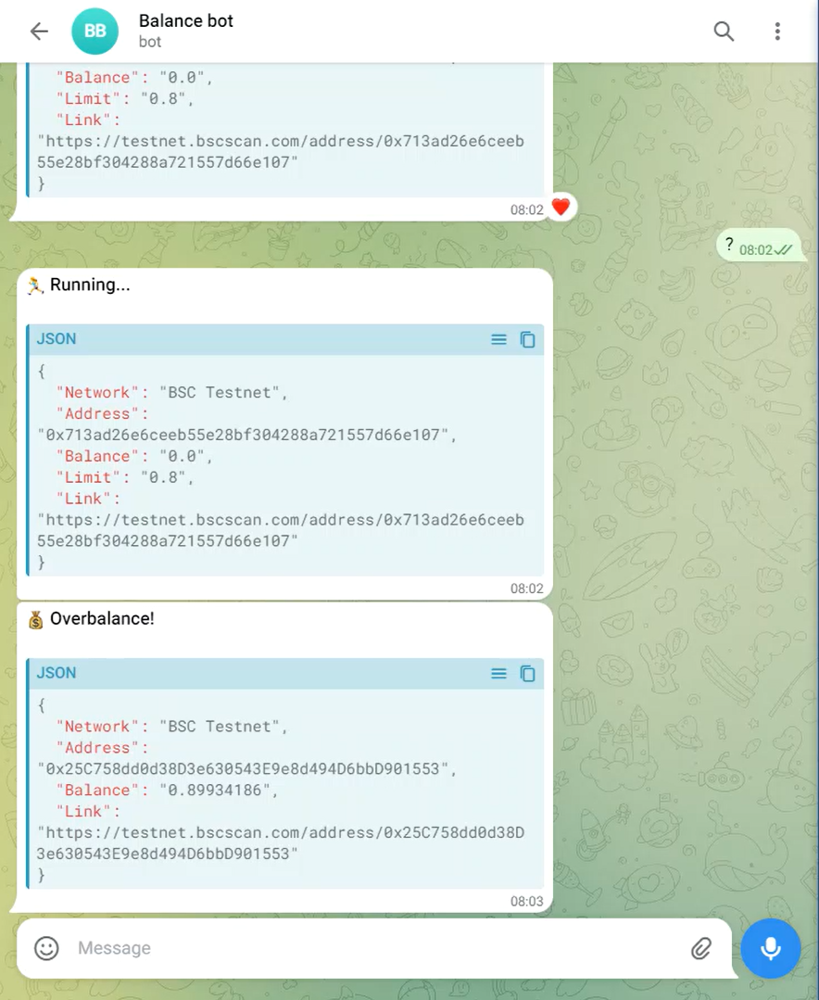

## BBot

The bot is a telegrambot to alert overbalance of target wallet.
You can set the network chain and the overbalance limit.
The bot is designed to keep you informed about overbalances on your specified networks, wallets, and limit.
With the bot, you can set up notifications tailored to your needs, ensuring that you stay on top of any potential overbalance situations. 

